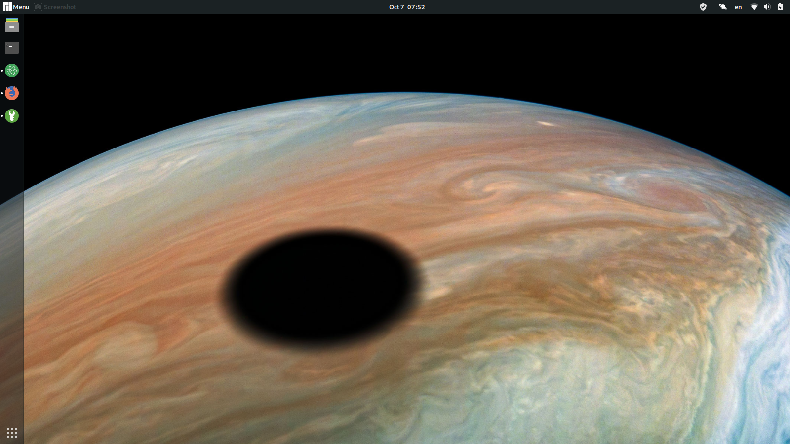

# Core System
[](./LICENSE.txt) [](https://www.codacy.com/manual/KevinFrantz/core-system?utm_source=github.com&amp;utm_medium=referral&amp;utm_content=KevinFrantz/core-system&amp;utm_campaign=Badge_Grade) <!--[](https://travis-ci.org/KevinFrantz/core-system)-->

## Goal
The goal is to never setup and configure a system again or to care about loosing passwords and important data.

## Description
This repository contains scripts to set up an working client system, maintain it and to save all important and configuration data on an USB stick. The data is stored encrypted with [EncFS](https://en.wikipedia.org/wiki/EncFS).
It's adapted to the needs of Kevin Veen-Birkenbach aka. Frantz. Feel free to modularize it and to adapt it to your needs.


<sub>*Core System* changes the wallpaper every day to the [Astronomy Picture of the Day](https://apod.nasa.gov/apod/). This wallpaper is from the 2019-10-07 and shows Jupiter with the shadow of his moon Io. </sub>

## Requirements
This script is optimized for a [Manjaro Linux](https://manjaro.org) with a [GNOME desktop](https://www.gnome.org/?). It's recommended to encrypt the hard drive with [LUKS](https://en.wikipedia.org/wiki/Linux_Unified_Key_Setup) if the computer isn't shared.

## System
### Key Bindings
The following *Core System* specific key bindings exist:

|Combination |Result                              |
|------------|------------------------------------|
|Ctrl+Alt+A  |Opens Atom                          |
|Ctrl+Alt+C  |Opens the capture\screenshot dialog |
|Ctrl+Alt+E  |Opens Eclipse                       |
|Ctrl+Alt+F  |Opens Firefox                       |
|Ctrl+Alt+K  |Opens KeePassXC                     |
|Ctrl+Alt+R  |Opens Rhyhtmbox                     |
|Ctrl+Alt+S  |Imports data to core system         |
|Ctrl+Alt+T  |Opens a terminal                    |
|Ctrl+Alt+V  |Opens VLC player                    |

### User Data
Right now the software expects that the *Core System Owner* has on all systems the same username. By executing the *import script* it automatic backups the application configuration data, ssh keys and other important data which is saved in well defined configuration files and folders.
#### Folders
Next to this the following specific folders exist:

| Path                        | Description |
|---|---|
$HOME/Documents/certificates/ | Contains certificates to authenticate via [certificate based authentication](https://blog.couchbase.com/x-509-certificate-based-authentication/). |
| $HOME/Documents/recovery_codes/ | Contains files with recovery_codes e.g. for [Two-factor authentication](https://en.wikipedia.org/wiki/Multi-factor_authentication). |
| $HOME/Documents/identity/ | Contains files to prove the identity of the *Core System Owner* in physical live like passports. |
| $HOME/Documents/passwords/ | Contains e.g the [KeePassXC](https://keepassxc.org/) database with all *Core System Owner* passwords. |

### Functions

| Order | Description |
|---|---|
| ```bash ./scripts/system-setup.sh``` | Setup the customized software on the system on which you execute it. |
| ```bash ./scripts/import-data-from-system.sh``` | Import data from the host system.|
| ```bash ./scripts/export-data-to-system.sh``` | Export data to the host system.|
| ```bash ./scripts/unlock.sh``` | Unlock the stored data.|
| ```bash ./scripts/lock.sh``` | Lock the stored data |
| ```encfsctl passwd .encrypted``` | Change the password of the encrypted folder. |

## License
The ["GNU GENERAL PUBLIC LICENSE Version 3"](./LICENSE.txt) applies to this project.
